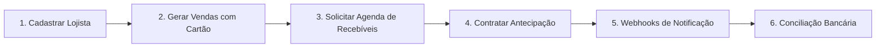

# Veragi Receivables Simulator

O **Veragi Receivables Simulator** é um simulador completo e de alta fidelidade para o ecossistema de **registro, antecipação e conciliação de recebíveis de cartão**.

Ele replica as APIs de um fornecedor/registradora de recebíveis (.NET 10, C#, Minimal APIs e MongoDB), permitindo testar fluxos ponta a ponta sem depender de ambientes externos lentos ou instáveis.

---

## Visão Geral e Motivação

### Por que este simulador existe?
No mercado de pagamentos e crédito (adquirência, subadquirência e fintechs), as empresas precisam integrar seus sistemas com **registradoras de recebíveis** (como CERC, CIP, B3) para:
1. Consultar a **agenda de recebíveis futuros** de cartão de um lojista.
2. Realizar a **antecipação de recebíveis** (concessão de crédito com garantia sobre vendas futuras).
3. Receber **notificações via webhook** quando agendas e contratos são processados.
4. Realizar a **conciliação bancária**, dando baixa nos recebíveis conforme os pagamentos caem na conta bancária.

### Os desafios que o simulador resolve:
- **Sandboxes externas instáveis:** Ambientes de teste de registradoras e fornecedores frequentemente sofrem com lentidão, instabilidade e períodos de manutenção.
- **Dificuldade para testar cenários de erro:** Testar cenários como falhas intermitentes de rede (HTTP 503), recusa por falta de saldo, estouro de garantia ou retries de webhooks com backoff é quase impossível em ambientes compartilhados.
- **Testes determinísticos e velozes:** Com o simulador local, qualquer equipe de engenharia consegue rodar testes unitários, de integração e fluxos E2E em segundos, com banco de dados isolado e previsível.

---

## Como Funciona o Ciclo de Negócio

O ciclo financeiro simulado segue 6 passos fundamentais:



1. **Cadastrar o Lojista (Merchant):** Registra o CNPJ, dados de contato, credenciadoras autorizadas (ex: Cielo, Rede), bandeiras/arranjos aceitos (ex: Visa Crédito, Mastercard Débito) e contas bancárias de liquidação.
2. **Gerar Vendas:** Simula compras passadas na maquininha de cartão do lojista, gerando parcelas futuras que se transformam em Unidades de Recebíveis (URs).
3. **Solicitar Agenda:** O lojista ou financiador solicita a apuração da agenda futura. A API retorna `202 Accepted` com um `requestId`, apura as vendas e notifica via webhook.
4. **Antecipar Recebíveis:** O lojista contrata uma antecipação informando quais URs quer dar em garantia e o valor desejado. O simulador apura o alcance financeiro real e compromete o saldo das URs.
5. **Webhooks:** O simulador notifica o sistema parceiro informando o resultado da agenda apurada e do contrato formalizado.
6. **Conciliação Bancária:** Conforme os pagamentos caem na conta, lançamentos bancários são registrados na API, que faz o rateio automático entre os contratos ativos e liquida os recebíveis.

---

## Arquitetura da Solução

O projeto segue Clean Architecture com separação rigorosa de responsabilidades e **100% de cobertura de código**:

```
MVFC.Veragi.Simulator/
├── src/
│   ├── MVFC.Veragi.Simulator.Api/          # Minimal APIs, mapeamento de rotas e schedulers
│   ├── MVFC.Veragi.Simulator.Domain/       # Handlers MediatR, regras de negócio, serviços e entidades
│   ├── MVFC.Veragi.Simulator.Data/         # DbContext e repositórios EF Core com MongoDB real
│   ├── MVFC.Veragi.Simulator.IoC/          # Injeção de dependência e client HTTP de webhooks
│   └── MVFC.Veragi.Simulator.Shareable/    # DTOs de request/response, enums e Result pattern
├── playground/
│   ├── MVFC.Veragi.Simulator.AppHost/      # Orquestração local com .NET Aspire e MongoDB
│   ├── MVFC.Veragi.Simulator.WebhookWorker/# Receptor Minimal API leve que recebe webhooks e loga
│   └── compose.yaml                   # Subida do MongoDB via Docker para execução sem Aspire
├── tests/                             # 5 projetos de teste divididos por domínio (631 testes)
├── scripts/
│   ├── 00-complete-flow.http          # Fluxo completo ponta a ponta (31 etapas)
│   ├── cenarios/                      # 16 cenários de negócio automatizados (01 a 16)
│   └── payloads/                      # Payloads JSON compartilhados
└── docs/handlers/                     # Documentação de cada handler (diagrama, payload e objetivo)
```

---

## Rotas da API (Guia Prático)

A API roda em `http://localhost:5080`.
O worker receptor de webhooks roda em `http://localhost:5090`.

### 1. Rotas do Fornecedor (`/module/card-receivable`)

| Método   | Caminho                               | O que faz                                                 | Exemplo                                      |
| -------- | ------------------------------------- | --------------------------------------------------------- | -------------------------------------------- |
| `GET`    | `/bases-control/acquirers`            | Lista credenciadoras parceiras (Cielo, Rede, etc.)        | `/bases-control/acquirers`                   |
| `GET`    | `/bases-control/payment-arrangements` | Lista arranjos de pagamento (VCC, MCC, etc.)              | `/bases-control/payment-arrangements`        |
| `POST`   | `/merchants`                          | Cadastra um lojista e seu escopo de credenciadoras/contas | Payload abaixo (201 Created)                 |
| `GET`    | `/merchants/{cnpj}`                   | Consulta o cadastro completo do lojista                   | `/merchants/22185894000174`                  |
| `PATCH`  | `/merchants/{cnpj}`                   | Atualiza telefone, e-mail ou escopo do lojista            | `/merchants/22185894000174`                  |
| `DELETE` | `/merchants/{cnpj}`                   | Inativa logicamente o lojista                             | `/merchants/22185894000174`                  |
| `POST`   | `/schedules/query-requests`           | Solicita processamento assíncrono da agenda               | Retorna `requestId` (202 Accepted)           |
| `GET`    | `/schedules/query-requests/{id}`      | Consulta o status e URs da agenda solicitada              | `/schedules/query-requests/UUID`             |
| `POST`   | `/contracts/anticipation`             | Formaliza antecipação com garantias sobre as URs          | Retorna contrato e status inicial            |
| `GET`    | `/contracts`                          | Lista contratos ativos ou inativos do lojista             | `/contracts?contractorCnpj=CNPJ`             |
| `GET`    | `/contracts/by-external-reference`    | Consulta contrato por referência externa                  | `?contractorCnpj=CNPJ&externalReference=REF` |
| `POST`   | `/reconciliation/entry`               | Registra lançamento bancário e rateia nos contratos       | Retorna 201 No Content                       |

### 2. Rotas de Controle do Simulador (`/_simulator`)

| Método   | Caminho                                               | O que faz                                                                    |
| -------- | ----------------------------------------------------- | ---------------------------------------------------------------------------- |
| `POST`   | `/_simulator/merchants/{cnpj}/sales/generate`         | Gera vendas de cartão sintéticas persistidas                                 |
| `GET`    | `/_simulator/merchants/{cnpj}/sales`                  | Lista as parcelas de vendas geradas                                          |
| `POST`   | `/_simulator/merchants/{cnpj}/external-anticipations` | Simula antecipação prévia feita em outro banco                               |
| `POST`   | `/_simulator/run`                                     | Força a execução imediata e síncrona de um ciclo de processamento e webhooks |
| `POST`   | `/_simulator/reset`                                   | Apaga todos os dados operacionais, restaurando o banco ao estado inicial     |
| `PUT`    | `/_simulator/webhooks`                                | Configura dinamicamente as URLs de destino dos webhooks                      |
| `GET`    | `/_simulator/webhooks`                                | Consulta as URLs de webhook ativas                                           |
| `GET`    | `/_simulator/deliveries`                              | Inspeciona a fila outbox de webhooks enviados e tentativas                   |
| `POST`   | `/_simulator/deliveries/{id}/replay`                  | Reenvia um webhook com a mesma chave e payload original                      |
| `GET`    | `/_simulator/reconciliation/entries`                  | Inspeciona o ledger de conciliação bancária                                  |
| `PUT`    | `/_simulator/contracts/availability`                  | Define a política de saldo: `IMMEDIATE` ou `DEFERRED`                        |
| `PUT`    | `/_simulator/scenarios/{target}`                      | Injeta regras de simulação (falhas HTTP, status forçados, `holdProcessing`)  |
| `DELETE` | `/_simulator/scenarios/{target}`                      | Remove regras de simulação ativas                                            |

---

## Cenários de Teste Automatizados (`scripts/cenarios/`)

A suíte em `scripts/cenarios/` contém **16 cenários de negócio automatizados**, independentes e organizados em ordem estrita de **01 a 16**. Cada um cria seus próprios dados e valida o comportamento esperado com asserções:

### [01-duas-falhas-http.http](scripts/cenarios/01-duas-falhas-http.http) — Resiliência a Falhas Transitórias
- **O que faz:** Injeta uma regra para que a rota de credenciadoras falhe 2 vezes consecutivas com HTTP 503 Service Unavailable e normalize na terceira chamada.
- **Validação:** Valida que o cliente recebe 503 nas duas primeiras chamadas e 200 OK com os dados corretos na terceira.

### [02-agenda-sem-vendas.http](scripts/cenarios/02-agenda-sem-vendas.http) — Consulta de Agenda Vazia
- **O que faz:** Cadastra um lojista novo sem gerar nenhuma venda e solicita a agenda de recebíveis.
- **Validação:** Após o processamento, confirma que a agenda é concluída com sucesso (`PROCESSED`), mas retorna lista vazia de credenciadoras e URs.

### [03-status-processando-e-sucesso.http](scripts/cenarios/03-status-processando-e-sucesso.http) — Status Intermediário PROCESSING
- **O que faz:** Configura o simulador para manter a agenda em estado intermediário `PROCESSING` no primeiro ciclo e finalizar com `PROCESSED` apenas no segundo ciclo.
- **Validação:** Verifica a transição correta de status da solicitação entre os dois ciclos de processamento.

### [04-antecipacao-total-da-agenda.http](scripts/cenarios/04-antecipacao-total-da-agenda.http) — Antecipação Integral de Todas as URs
- **O que faz:** Gera vendas em múltiplas datas e credenciadoras e contrata 100% de todo o saldo livre disponível em todas as URs da agenda (total de 200.000).
- **Validação:** Confirma que o contrato alcança o valor integral solicitado e zera todo o saldo antecipável do lojista.

### [05-valor-alcancado-menor.http](scripts/cenarios/05-valor-alcancado-menor.http) — Alcance Reduzido por Compromisso Externo
- **O que faz:** O lojista possui uma UR de 10.000. Simula que 8.000 já foram antecipados em outro banco via `external-anticipations`. Em seguida, solicita antecipação de 10.000.
- **Validação:** Confirma a regra de garantia do Banco Central: o contrato aceita a garantia, mas o valor alcançado é limitado ao saldo restante real de 2.000.

### [06-duas-falhas-no-webhook.http](scripts/cenarios/06-duas-falhas-no-webhook.http) — Retentativa com Backoff Exponencial
- **O que faz:** Configura o endpoint receptor para falhar com 503 nas duas primeiras tentativas de entrega de webhook.
- **Validação:** Demonstra a resiliência da fila outbox: o simulador aplica backoff exponencial, incrementa contadores de tentativas e entrega o webhook com sucesso na terceira tentativa.

### [07-identificadores-e-enums.http](scripts/cenarios/07-identificadores-e-enums.http) — Validação de Schemas e Identificadores
- **O que faz:** Testa o rigor do contrato Swagger: rejeita modalidade numérica, rejeita UUID v5 malformatado e aceita requisições com UUID v7.
- **Validação:** Assegura que o simulador segue fielmente os padrões de tipagem e integridade do contrato oficial.

### [08-agenda-esgotada-immediate.http](scripts/cenarios/08-agenda-esgotada-immediate.http) — Política IMMEDIATE: Recusa Síncrona 422
- **O que faz:** Ativa a política padrão `IMMEDIATE`. Esgota o saldo de uma UR e tenta fazer uma nova antecipação sobre ela.
- **Validação:** A API recusa a contratação imediatamente com HTTP 422 e erro `INSUFFICIENT_RECEIVABLE_BALANCE`, sem criar operações pendentes.

### [09-agenda-esgotada-deferred.http](scripts/cenarios/09-agenda-esgotada-deferred.http) — Política DEFERRED: Cancelamento Diferido
- **O que faz:** Ativa a política `DEFERRED`. Solicita antecipação sobre uma UR sem saldo.
- **Validação:** A contratação é aceita inicialmente (HTTP 201 com status 6 - Em Processamento). No ciclo de processamento, o simulador cancela o contrato (status 2 - Cancelado) e envia webhook com status `ERROR`.

### [10-invalid-payloads.http](scripts/cenarios/10-invalid-payloads.http) — Tratamento de Entradas Inválidas
- **O que faz:** Envia payloads malformados, CNPJs com tamanho incorreto e tenta acessar catálogos com dados corrompidos.
- **Validação:** Confirma que a API responde com status 400 Bad Request detalhado via ProblemDetails sem lançar exceções não tratadas.

### [11-conciliacao-bancaria.http](scripts/cenarios/11-conciliacao-bancaria.http) — Rateio de Pagamentos e Ledger
- **O que faz:** Realiza o fluxo bancário: registra um lançamento de pagamento parcial, tenta registrar lançamento duplicado (recusado com 400) e registra valor superior à dívida.
- **Validação:** Valida o rateio proporcional por contrato e recebível, a quitação dos saldos e a preservação auditável do valor excedente (`unallocatedAmount`).

### [12-idempotency.http](scripts/cenarios/12-idempotency.http) — Idempotência de Solicitação de Agenda
- **O que faz:** Envia a mesma chave `Idempotency-Key` com o mesmo payload para solicitação de agenda, e testa consulta simultânea ativa.
- **Validação:** Retorna a operação original existente para mesma chave e devolve HTTP 409 Conflict se houver consulta pendente ativa concorrente.

### [13-schedule-error.http](scripts/cenarios/13-schedule-error.http) — Erro de Processamento de Agenda
- **O que faz:** Configura o processador de agenda para simular falha interna de negócio (`ERROR`).
- **Validação:** A agenda é atualizada para `ERROR` e o webhook é disparado com status de falha, permitindo ao integrador tratar erros assíncronos.

### [14-webhook-replay.http](scripts/cenarios/14-webhook-replay.http) — Reenvio Manual de Eventos (Replay)
- **O que faz:** Localiza uma entrega de webhook já concluída e executa a rota `POST /_simulator/deliveries/{id}/replay`.
- **Validação:** Zera as tentativas da entrega na outbox e despacha novamente o mesmo payload com a mesma chave original.

### [15-contract-error.http](scripts/cenarios/15-contract-error.http) — Cancelamento de Contrato e Preservação de Saldo
- **O que faz:** Simula o cancelamento de um contrato no processamento.
- **Validação:** Comprova que, ao ser cancelado, a reserva sobre a UR é liberada imediatamente, preservando o saldo livre para futuras antecipações.

### [16-contract-idempotency.http](scripts/cenarios/16-contract-idempotency.http) — Idempotência de Contratos
- **O que faz:** Reenvia contratação com mesma `Idempotency-Key` e mesmo payload, e depois tenta reutilizar a mesma chave com payload alterado.
- **Validação:** Retorna 201 com o contrato original no primeiro caso e recusa com HTTP 409 Conflict no segundo caso.

---

## Fluxo Completo de Ponta a Ponta (`scripts/00-complete-flow.http`)

Para demonstrar o ciclo de vida completo em uma única execução contínua, o arquivo `00-complete-flow.http` encadeia **31 etapas numeradas**:

| Etapas    | Ação Realizada                                                                                               |
| --------- | ------------------------------------------------------------------------------------------------------------ |
| **01–02** | Reset total da base do simulador e cadastro dos destinos de webhook do worker                                |
| **03–05** | Consulta catálogos de credenciadoras e arranjos e cadastra um novo lojista                                   |
| **06**    | Gera lote de vendas flexíveis (à vista e parceladas com valores variados)                                    |
| **07–09** | Solicita agenda de recebíveis, processa deterministicamente e consulta o saldo das URs                       |
| **10–12** | Antecipa parcialmente 25% de uma UR, processa e valida garantias alcançadas                                  |
| **13**    | Consulta a agenda e comprova o débito automático sobre a UR escolhida                                        |
| **14–16** | Antecipa o restante do saldo da mesma UR e valida quitação da reserva                                        |
| **17**    | Comprova saldo zerado na UR selecionada e preservação das demais URs                                         |
| **18–24** | Testa recusa imediata 422, altera política para diferida, aceita pedido sem saldo e cancela no processamento |
| **25–27** | Registra pagamentos bancários parciais, rateia entre os contratos e valida ledger                            |
| **28–31** | Lista contratos ativos, atualiza dados cadastrais e inativa o lojista                                        |

---

## Como Executar

### Pré-requisitos
- .NET 10 SDK
- Docker Desktop (para rodar o MongoDB com replica set)

O .NET Aspire sobe o MongoDB com Replica Set, o Worker na porta 5090 e a API na porta 5080 de forma automatizada:

```bash
dotnet restore MVFC.Veragi.Simulator.slnx
dotnet build MVFC.Veragi.Simulator.slnx
dotnet run --project playground/MVFC.Veragi.Simulator.AppHost
```
---

## Executando os Testes

A solução conta com **633 testes automatizados** (unitários e de integração com MongoDB real), cobrindo **100% das linhas e branches** de todos os assemblies de produção.

Para rodar toda a bateria de testes:

```bash
dotnet test MVFC.Veragi.Simulator.slnx
```

Para executar os testes coletando métricas de cobertura de código:

```bash
dotnet test --collect:"XPlat Code Coverage"
```

---

## Licença e Especificações
Este simulador foi desenvolvido com base nas especificações Swagger documentadas em `specifications/swagger.json`, atendendo aos requisitos regulatórios e operacionais de recebíveis de cartão.
