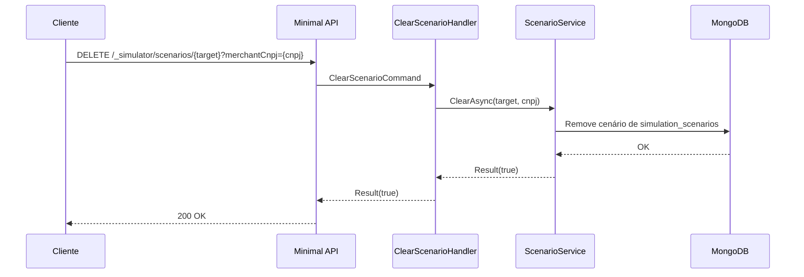

# ClearScenarioHandler

## Descrição
Remove a configuração de simulação ativa (falhas HTTP, status forçados, retenção de processamento) de um alvo especificado, de forma global ou restrita a um estabelecimento específico.

- **Rota:** `DELETE /_simulator/scenarios/{target}?merchantCnpj={cnpj}`
- **Retorno:** HTTP 200 com `{ "data": true }`.

## Payload
Esta requisição não possui corpo no request.

**Parâmetros:**
- `target` (URL, obrigatório): identificador do alvo (ex: `schedule-process`, `contract-process`, `acquirers-list`).
- `merchantCnpj` (Query string, opcional): CNPJ do estabelecimento. Se omitido, remove a regra global.

**Resposta (HTTP 200):**
```json
{
  "data": true
}
```

## Diagrama

