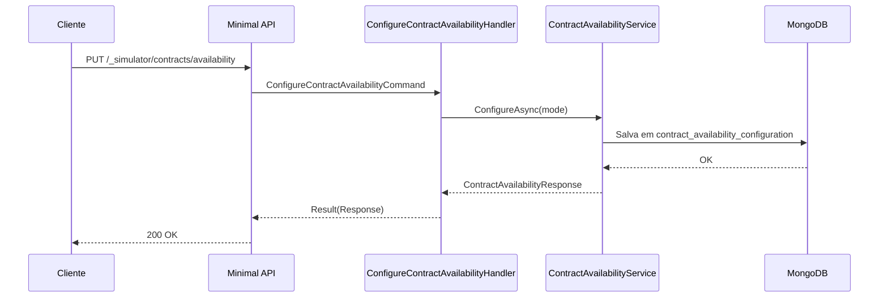

# ConfigureContractAvailabilityHandler

## Descrição
Configura a política de validação de saldo para contratações de antecipação. Permite alternar entre recusa síncrona imediata (`IMMEDIATE`) e recusa diferida durante o ciclo de processamento (`DEFERRED`).

- **Rota:** `PUT /_simulator/contracts/availability`
- **Retorno:** HTTP 200 com a política persistida.

## Payload
**Requisição (JSON):**
```json
{
  "mode": "IMMEDIATE"
}
```
*Valores aceitos para `mode`: `"IMMEDIATE"` ou `"DEFERRED"`.*

**Resposta (HTTP 200):**
```json
{
  "data": {
    "mode": "IMMEDIATE"
  }
}
```

## Diagrama

