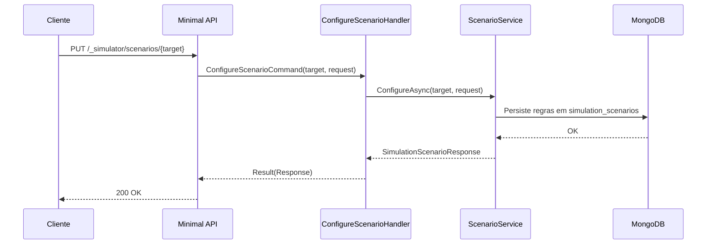

# ConfigureScenarioHandler

## Descrição
Configura regras de simulação para um alvo de API ou processamento (falhas HTTP simuladas, sequência customizada de status para agenda ou contrato e retenção em fila `holdProcessing`).

- **Rota:** `PUT /_simulator/scenarios/{target}`
- **Retorno:** HTTP 200 com a configuração de cenário criada/atualizada.

## Payload
**Requisição (JSON):**
```json
{
  "merchantCnpj": "22185894000174",
  "failuresRemaining": 2,
  "failureStatusCode": 503,
  "holdProcessing": false,
  "processingOutcomes": [
    "PROCESSING",
    "PROCESSED"
  ],
  "contractStatuses": [
    "PendingRegistration",
    "Active"
  ]
}
```
*Campos opcionais conforme o alvo selecionado. Para simulação global, omita `merchantCnpj`.*

**Resposta (HTTP 200):**
```json
{
  "data": {
    "target": "schedule-process",
    "merchantCnpj": "22185894000174",
    "failuresRemaining": 2,
    "failureStatusCode": 503,
    "holdProcessing": false,
    "calls": 0,
    "processingOutcomes": ["PROCESSING", "PROCESSED"],
    "contractStatuses": []
  }
}
```

## Diagrama

