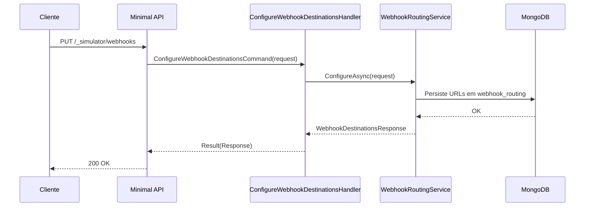

# ConfigureWebhookDestinationsHandler

## Descrição
Configura dinamicamente as URLs de destino para as entregas de webhooks de atualização de agenda e de contrato antecipado.

- **Rota:** `PUT /_simulator/webhooks`
- **Retorno:** HTTP 200 com os destinos persistidos.

## Payload
**Requisição (JSON):**
```json
{
  "scheduleUrl": "http://localhost:5090/webhooks/card-receivables/schedules/updated",
  "contractUrl": "http://localhost:5090/webhooks/card-receivable/schedules"
}
```

**Resposta (HTTP 200):**
```json
{
  "data": {
    "scheduleUrl": "http://localhost:5090/webhooks/card-receivables/schedules/updated",
    "contractUrl": "http://localhost:5090/webhooks/card-receivable/schedules",
    "persisted": true
  }
}
```

## Diagrama

