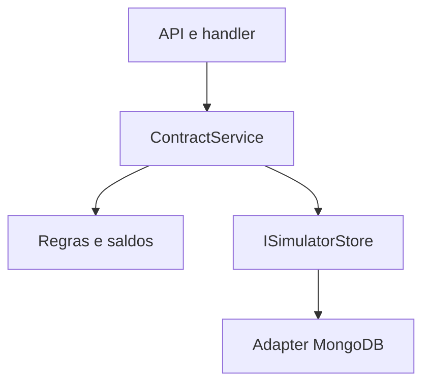
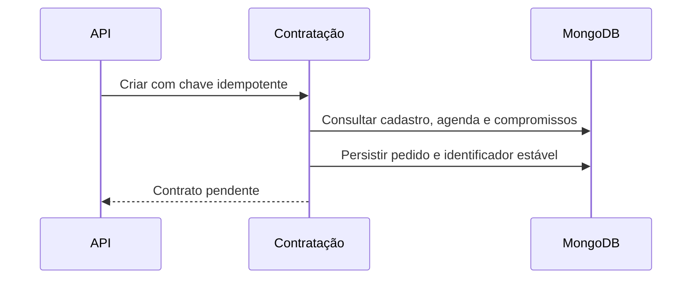

# CreateAnticipationHandler

## Objetivo e entrada
Registra uma solicitação de antecipação sobre unidades de recebíveis de uma agenda processada. O resultado inicial está pendente de registro; o processamento posterior determina o alcance efetivo e publica o webhook.

- Rota: `POST /module/card-receivable/contracts/anticipation`.
- Header obrigatório: `Idempotency-Key` (UUID).
- Resposta: HTTP 201, envelope `ApiResponse` com lista de contratos.

## Requisição
```json
{
  "financierContractId": "HTTP-1791216610601-TOTAL",
  "contractorCnpj": "22185894000174",
  "signatureDate": "2026-10-05",
  "requestedAmount": 2500.00,
  "guarantees": [
    {
      "receivableUnitHolderCnpj": "22185894000174",
      "finalUserReceiverCnpj": "22185894000174",
      "acquirerCnpj": "01027058000191",
      "paymentArrangementCode": "VCC",
      "settlementDate": "2026-11-10",
      "definedAmount": 2500.00
    }
  ]
}
```
`financierContractId`, `wallet` e `settlementBankAccount` são opcionais. O exemplo usa a conta de antecipação cadastrada no estabelecimento. Se `financierContractId` for informado, seu valor entre 1 e 45 caracteres é preservado. Quando omitido, mantém o fallback para a referência externa do contrato.

A referência externa (`externalReference`) identifica o contrato no fornecedor, suas consultas e alocações. Para todo contrato novo, o simulador gera `CON/########/##############/######/######` uma única vez e persiste na operação. Os blocos finais usam a data/hora UTC da criação; os demais números são sintéticos. Contratos existentes mantêm suas referências persistidas, inclusive `SIM-...`. A chave idempotente e o identificador do financiador são independentes dessa geração.

## Resposta representativa
```json
{
  "message": "Request processed",
  "timestamp": "2026-10-05T12:00:00Z",
  "traceId": "d018583c-5e19-44f0-a9c4-9fe935da7d9b",
  "data": [
    {
      "externalReference": "CON/07237373/21892484000109/051026/120000",
      "financierContractId": "HTTP-1791216610601-TOTAL",
      "status": 6,
      "contractorCnpj": "22185894000174",
      "effectType": 1,
      "signatureDate": "2026-10-05",
      "dueDate": "2026-11-10",
      "guaranteedLimitAmount": 2500.00,
      "reachedAmount": 0,
      "updatedAmount": 0
    }
  ],
  "metadata": { "apiVersion": "v1", "processTime": 0 }
}
```

## Pré-condições e fluxo
O estabelecimento deve existir e estar ativo, permitir antecipação ocasional e possuir conta aplicável. A soma de `definedAmount` deve ser igual a `requestedAmount`; datas, raiz do CNPJ e precisão monetária seguem os validators/regras existentes. As garantias devem constar na agenda processada. Em modo IMMEDIATE, ausência total de saldo resulta em 422; em DEFERRED a decisão acontece no processamento. Alcance parcial permanece permitido.

Mesma chave e mesmo payload retornam a operação existente. Mesma chave com payload diferente retorna 409. O hash e o RequestJson conservam a entrada original, inclusive a ausência do identificador opcional. O identificador gerado permanece estável durante processamento, retry, consulta e reinício.

## Falhas e efeitos
- 400: schema, formato ou regra de entrada inválidos.
- 404: estabelecimento ausente/inativo.
- 409: reutilização divergente da chave idempotente.
- 422: pré-condições de negócio/saldo não atendidas.
- Falhas de infraestrutura: tratamento centralizado da API e HTTP 500.

Persiste uma operação em MongoDB; não chama fornecedor externo. Schedulers posteriores processam o contrato, atualizam agendas e criam entregas na fila de webhooks. As falhas esperadas usam Result/ProblemDetails. O `traceId` do envelope é GUID em string; não são acrescentados logs com payloads sensíveis.

## Estrutura e sequência



## Código e testes
`ContractService`, `ContractRules`, `ScheduledOperationMappings`, `ContractIdentifierGenerator`, `ContractRegistrationService`; `ContractIdentifierTests`, `ContractIdentifierFlowTests`, `ContractProcessingTests`, `ContractAvailabilityTests` e `ContractAgendaTests`.
