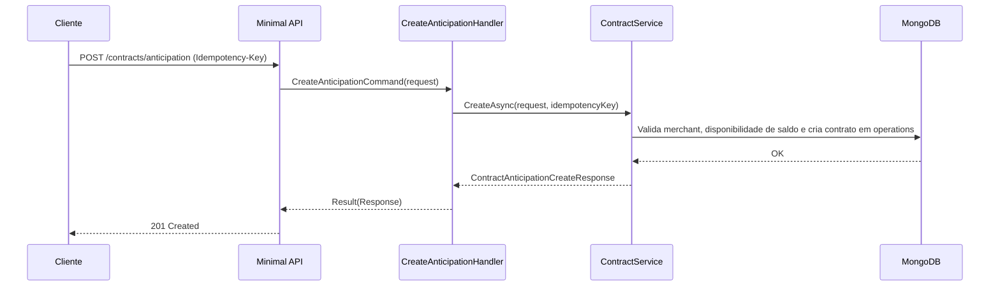

# CreateAnticipationHandler

## Descrição
Registra a solicitação de antecipação de recebíveis de cartão. Cria a operação de contrato vinculada às unidades recebíveis (URs) do estabelecimento, aplicando as regras de validação de saldo e política de disponibilidade.

- **Rota:** `POST /module/card-receivable/contracts/anticipation`
- **Headers:** `Idempotency-Key` (UUID)
- **Retorno:** HTTP 201 com os dados do contrato criado.

## Payload
**Requisição (JSON):**
```json
{
  "externalReference": "REF-CONTRATO-001",
  "financierId": "FIN-001",
  "contractorCnpj": "22185894000174",
  "contractType": 2,
  "requestedAmount": 2500.00,
  "settlementAccount": {
    "account": "12345",
    "accountDigit": "6",
    "agency": "0001",
    "bank": "001",
    "accountType": "CC"
  },
  "guarantees": [
    {
      "acquirerCnpj": "01027058000191",
      "paymentArrangementCode": "VCC",
      "settlementDate": "2026-11-10",
      "definedAmount": 2500.00
    }
  ]
}
```

**Resposta (HTTP 201):**
```json
{
  "data": [
    {
      "externalReference": "REF-CONTRATO-001",
      "status": 6,
      "statusDescription": "Em Processamento",
      "contractType": 2,
      "contractorCnpj": "22185894000174"
    }
  ]
}
```

## Diagrama

