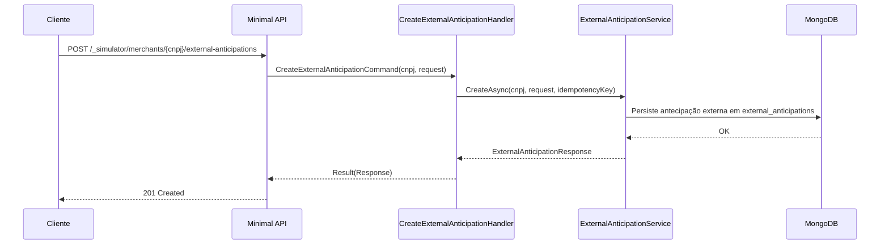

# CreateExternalAnticipationHandler

## Descrição
Registra uma antecipação externa prévia no simulador, simulando comprometimento de recebíveis realizado com outro credor. Reduz o saldo livre da unidade de recebível correspondente nas consultas subsequentes.

- **Rota:** `POST /_simulator/merchants/{cnpj}/external-anticipations`
- **Headers:** `Idempotency-Key` (UUID)
- **Retorno:** HTTP 201 com os dados da antecipação externa registrada.

## Payload
**Requisição (JSON):**
```json
{
  "acquirerCnpj": "01027058000191",
  "paymentArrangementCode": "VCC",
  "settlementDate": "2026-11-10",
  "amount": 8000.00
}
```

**Resposta (HTTP 201):**
```json
{
  "data": {
    "merchantCnpj": "22185894000174",
    "acquirerCnpj": "01027058000191",
    "paymentArrangementCode": "VCC",
    "settlementDate": "2026-11-10",
    "amount": 8000.00
  }
}
```

## Diagrama

