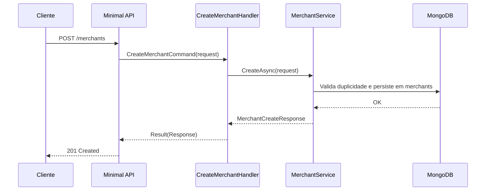

# CreateMerchantHandler

## Descrição
Cadastra um novo estabelecimento comercial (merchant) no simulador, definindo o escopo de credenciadoras aceitas, arranjos de pagamento e contas de liquidação.

- **Rota:** `POST /module/card-receivable/merchants`
- **Retorno:** HTTP 201 com os dados cadastrais do estabelecimento criado.

## Payload
**Requisição (JSON):**
```json
{
  "cnpj": "22185894000174",
  "corporateName": "Loja Exemplo LTDA",
  "tradeName": "Loja Exemplo",
  "email": "contato@exemplo.com",
  "mobilePhone": "11987654321",
  "settlementAccounts": [
    {
      "account": "12345",
      "accountDigit": "6",
      "agency": "0001",
      "bank": "001",
      "accountType": "CC"
    }
  ],
  "acquirers": [
    {
      "cnpj": "01027058000191",
      "paymentArrangementCodes": ["VCC", "MCC"]
    }
  ]
}
```

**Resposta (HTTP 201):**
```json
{
  "data": {
    "cnpj": "22185894000174",
    "corporateName": "Loja Exemplo LTDA",
    "tradeName": "Loja Exemplo",
    "status": 1
  }
}
```

## Diagrama

