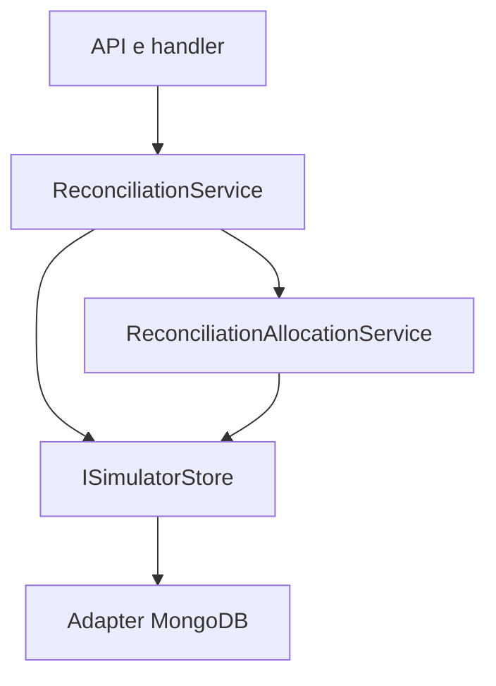
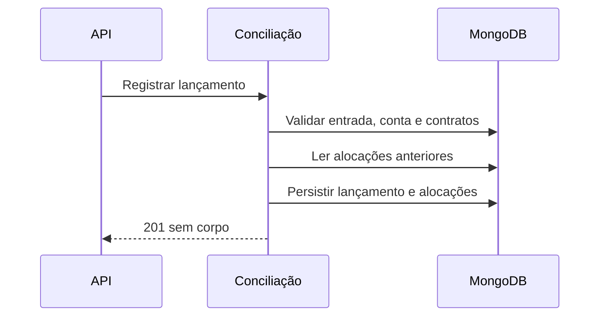

# CreateReconciliationHandler

## Objetivo e entrada
Registra um lançamento bancário e aloca o valor nos recebíveis de contratos ativos elegíveis, preservando excedentes no ledger.

- Rota: `POST /module/card-receivable/reconciliation/entry`.
- Resposta: HTTP 201 **sem corpo**.

## Requisição
```json
{
  "entryId": "d018583c-5e19-44f0-a9c4-9fe935da7d9b",
  "referenceDate": "2026-10-05",
  "merchant": "22185894000174",
  "acquirer": "01027058000191",
  "bankAccount": "12345-6",
  "value": 2500.00
}
```
Todos os campos do exemplo são obrigatórios. `referenceDate` deve ser a data corrente no fuso configurado. `entryId` é UUID; merchant/acquirer seguem o formato de CNPJ aceito pelo contrato; value é não negativo. A conta tem até 40 caracteres e deve estar vinculada a um contrato Active processado via API do estabelecimento.

## Política de alocação
`entryId` identifica um lançamento, não uma parcela. Um lançamento pode pagar várias URs e contratos; vários lançamentos podem pagar a mesma UR. A seleção usa o estabelecimento, a conta e a credenciadora informados. A data do lançamento não identifica uma UR específica.

A alocação é sequencial por vencimento da UR, criação do contrato, ID da operação, titular e arranjo. Não é rateio proporcional. O valor já alocado à identidade completa da UR daquele contrato é descontado antes de cada nova alocação. O restante fica em `unallocatedAmount`, inclusive quando a credenciadora válida não possui UR correspondente.

Invariável: `value = soma das alocações + unallocatedAmount`. Entradas repetindo entryId são rejeitadas com 400; um novo entryId continua sendo um lançamento independente, mesmo após consumir todo o saldo conciliável.

## Efeitos e falhas
Persiste payload original, alocações e excedente em `reconciliation_entries`. Não altera automaticamente o status ou o snapshot do contrato e não reabre saldo da agenda. A consulta de detalhes do contrato Active projeta sua dívida restante a partir do ledger. Não publica um novo tipo de webhook de pagamento.

400 para schema/regra inválidos, duplicado, estabelecimento inexistente/inativo, conta sem contrato Active ou data diferente de hoje. Erros inesperados seguem o tratamento centralizado da API. Dependência externa: MongoDB por ISimulatorStore; sem HTTP externo ou broker. Mantém logs e correlação existentes, sem logar payload bancário.

## Estrutura e sequência



## Código e testes
`ReconciliationService`, `ReconciliationAllocationService`, `ReconciliationMappings`; `ReconciliationRegistrationTests`, `ReconciliationAllocationTests`, `ReconciliationFlowTests` e `ContractDebtTests`.
