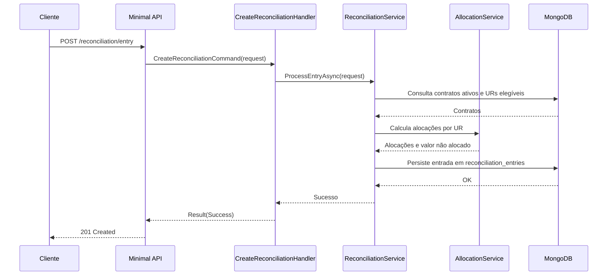

# CreateReconciliationHandler

## Descrição
Registra um lançamento bancário e realiza o rateio automático do valor pago entre os contratos de antecipação ativos vinculados à conta corrente do estabelecimento, atualizando o ledger de conciliação.

- **Rota:** `POST /module/card-receivable/reconciliation/entry`
- **Retorno:** HTTP 201 sem corpo.

## Payload
**Requisição (JSON):**
```json
{
  "entryId": "d018583c-5e19-44f0-a9c4-9fe935da7d9b",
  "referenceDate": "2026-10-04",
  "merchant": "22185894000174",
  "acquirer": "01027058000191",
  "bankAccount": "12345-6",
  "value": 2500.00
}
```

**Resposta (HTTP 201):**
*Sem corpo (No Content/Created).*

## Diagrama

