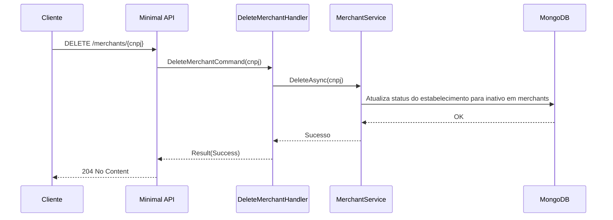

# DeleteMerchantHandler

## Descrição
Executa a exclusão lógica de um estabelecimento comercial (merchant), inativando seu cadastro no simulador.

- **Rota:** `DELETE /module/card-receivable/merchants/{cnpj}`
- **Retorno:** HTTP 204 No Content.

## Payload
Esta requisição não recebe corpo e não retorna conteúdo.

**Parâmetros:**
- `cnpj` (URL, obrigatório): CNPJ de 14 dígitos do estabelecimento a ser removido.

**Resposta (HTTP 204):**
*Sem corpo.*

## Diagrama

