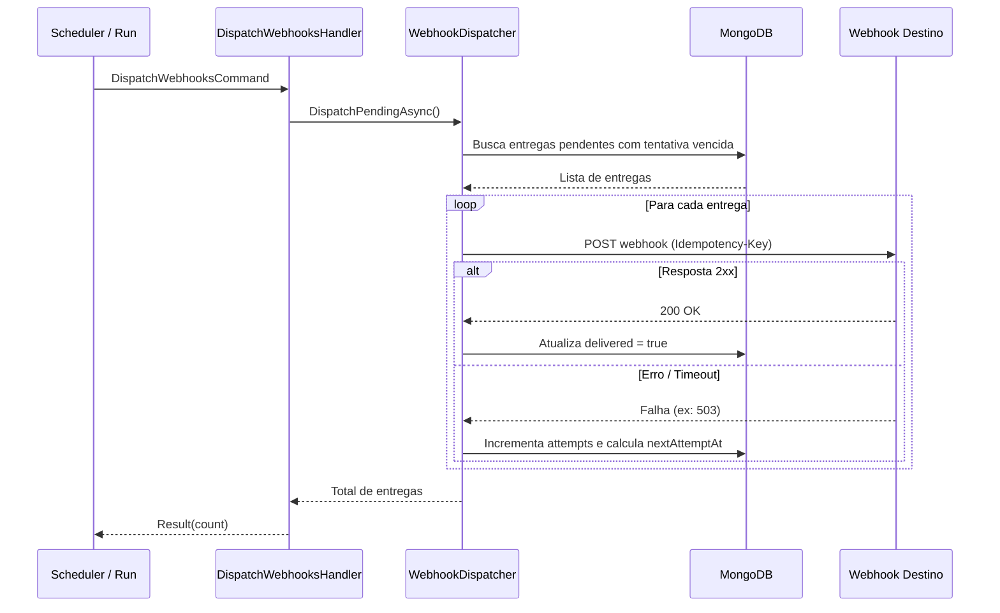

# DispatchWebhooksHandler

## Descrição
Despacha os eventos de webhook pendentes persistidos na fila outbox (`webhook_deliveries`) para as URLs configuradas dos parceiros (agenda e contratos), controlando número de tentativas e intervalos de repetição (backoff exponencial).

- **Invocação:** Disparado internamente pelo scheduler de entregas (`WebhookDeliveryScheduler`) ou manualmente via `POST /_simulator/run`.
- **Retorno:** Quantidade de entregas processadas com sucesso.

## Payload
Este handler é acionado internamente via `DispatchWebhooksCommand`.

**Exemplo do Payload HTTP de Notificação Enviado ao Destino:**
```json
{
  "status": "PROCESSED",
  "detail": "Contract processed",
  "scheduleQueryData": {
    "requestId": "fc3ec865-f088-4e22-af68-5581c280d3dc",
    "originType": "ONLINE",
    "updatedAt": "2026-10-04T12:00:00Z",
    "merchantCnpj": "22185894000174",
    "acquirers": [
      {
        "cnpj": "01027058000191",
        "paymentArrangements": [
          {
            "code": "VCC",
            "receivableUnits": [
              {
                "settlementDate": "2026-11-10",
                "totalAmount": 2500.00,
                "freeAmount": 0.00
              }
            ]
          }
        ]
      }
    ]
  }
}
```

## Diagrama

