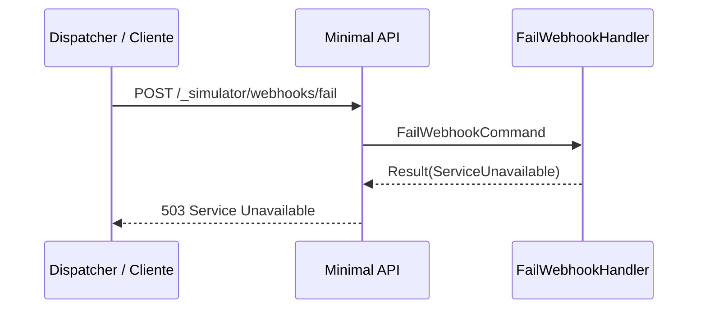

# FailWebhookHandler

## Descrição
Endpoint de diagnóstico utilizado em testes para simular indisponibilidade no recebimento de webhooks. Sempre responde com erro de servidor HTTP 503 Service Unavailable.

- **Rota:** `POST /_simulator/webhooks/fail`
- **Retorno:** HTTP 503 Service Unavailable.

## Payload
**Requisição:**
Sem corpo.

**Resposta (HTTP 503):**
```json
{
  "error": "Simulated failure"
}
```

## Diagrama

