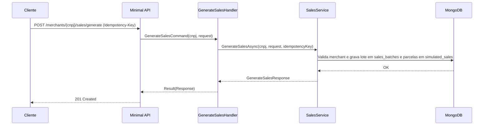

# GenerateSalesHandler

## Descrição
Gera vendas de cartão sintéticas persistidas no banco de dados para um estabelecimento credenciado, permitindo compor o saldo a receber em agendas futuras.

- **Rota:** `POST /_simulator/merchants/{cnpj}/sales/generate`
- **Headers:** `Idempotency-Key` (UUID)
- **Retorno:** HTTP 201 com o resumo do lote gerado (`batchId`, `salesCount`, `installmentCount`, `totalAmount`).

## Payload
**Requisição (JSON):**
```json
{
  "sales": [
    {
      "acquirerCnpj": "01027058000191",
      "paymentArrangementCode": "VCC",
      "installments": [
        {
          "amount": 5000.00,
          "settlementBusinessDays": 5
        },
        {
          "amount": 3000.00,
          "settlementBusinessDays": 10
        }
      ]
    }
  ]
}
```

**Resposta (HTTP 201):**
```json
{
  "data": {
    "batchId": "b18583c0-5e19-44f0-a9c4-9fe935da7d9b",
    "salesCount": 1,
    "installmentCount": 2,
    "totalAmount": 8000.00
  }
}
```

## Diagrama

