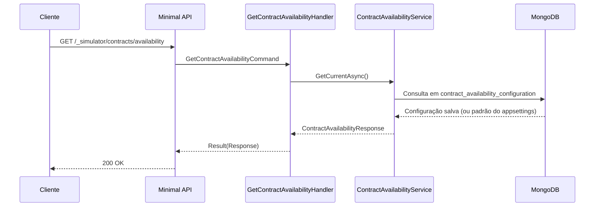

# GetContractAvailabilityHandler

## Descrição
Consulta a política ativa de disponibilidade de saldo para contratações de antecipação (`IMMEDIATE` ou `DEFERRED`).

- **Rota:** `GET /_simulator/contracts/availability`
- **Retorno:** HTTP 200 com a política vigente.

## Payload
Esta requisição não recebe corpo.

**Resposta (HTTP 200):**
```json
{
  "data": {
    "mode": "IMMEDIATE"
  }
}
```

## Diagrama

