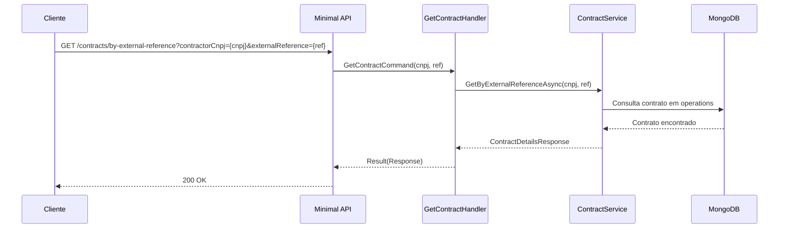

# GetContractHandler

## Descrição
Consulta os detalhes de um contrato de antecipação específico pela referência externa (`externalReference`) e CNPJ do contratante (`contractorCnpj`), retornando status de processamento, garantias alcançadas e valores efetivamente antecipados.

- **Rota:** `GET /module/card-receivable/contracts/by-external-reference?contractorCnpj={cnpj}&externalReference={externalReference}`
- **Retorno:** HTTP 200 com os dados detalhados do contrato.

## Payload
Esta requisição não recebe corpo.

**Parâmetros de Query:**
- `contractorCnpj` (obrigatório): CNPJ do estabelecimento titular.
- `externalReference` (obrigatório): código de referência do contrato informado na criação.

**Resposta (HTTP 200):**
```json
{
  "data": {
    "externalReference": "REF-CONTRATO-001",
    "contractorCnpj": "22185894000174",
    "contractType": 2,
    "status": 1,
    "statusDescription": "Ativo",
    "requestedAmount": 2500.00,
    "reachedGuarantees": [
      {
        "acquirers": [
          {
            "cnpj": "01027058000191",
            "paymentArrangements": [
              {
                "code": "VCC",
                "receivableUnits": [
                  {
                    "settlementDate": "2026-11-10",
                    "reachedAmount": 2500.00
                  }
                ]
              }
            ]
          }
        ]
      }
    ]
  }
}
```

## Diagrama

