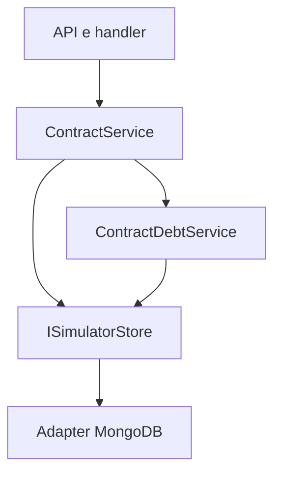
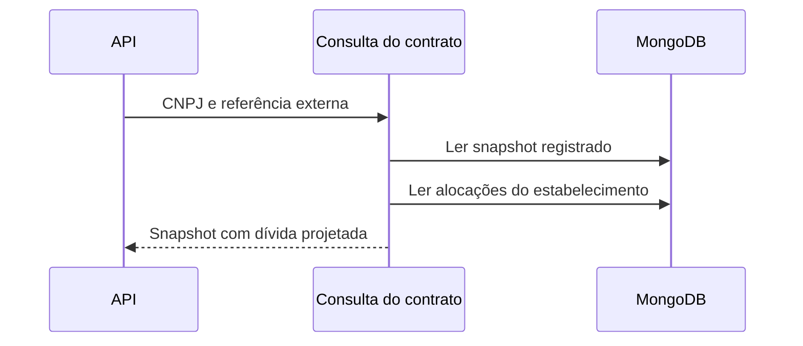

# GetContractHandler

## Objetivo e entrada
Consulta o contrato por CNPJ e referência externa, retornando garantias registradas e dívida simulada restante após pagamentos conciliados.

- Rota: `GET /module/card-receivable/contracts/by-external-reference`.
- Query obrigatória: `contractorCnpj`, `externalReference`.
- Resposta: HTTP 200 com envelope `ApiResponse<ContractByExternalReference>`.

A referência externa é obtida na criação (`CON/########/##############/######/######` para contratos novos); consultas de contratos antigos continuam usando a referência persistida, inclusive `SIM-...`. O `financierContractId` informado pelo cliente permanece independente. A requisição não recebe corpo; passe a referência completa como query parameter, usando o encoding do cliente HTTP.

## Resposta representativa
Exemplo: contrato com dívida inicial de R$ 2.500 e R$ 300 efetivamente alocados no ledger.
```json
{
  "message": "Request processed",
  "timestamp": "2026-10-05T12:00:00Z",
  "traceId": "d018583c-5e19-44f0-a9c4-9fe935da7d9b",
  "data": {
    "financierContractId": "HTTP-1791216610601-TOTAL",
    "contractorCnpj": "22185894000174",
    "status": 1,
    "effectType": 1,
    "signatureDate": "2026-10-05",
    "debtBalanceAmount": 2200.00,
    "guaranteedLimitAmount": 2500.00,
    "minimumBalanceAmount": 2500.00,
    "reachedGuarantees": [
      {
        "receivableUnitHolderCnpj": "22185894000174",
        "acquirers": [
          {
            "cnpj": "01027058000191",
            "paymentArrangements": [
              {
                "code": "VCC",
                "receivableUnits": [
                  {
                    "settlementDate": "2026-11-10",
                    "divisionRule": 1,
                    "requestedAmount": 2500.00,
                    "reachedAmount": 2500.00
                  }
                ]
              }
            ]
          }
        ]
      }
    ]
  },
  "metadata": { "apiVersion": "v1", "processTime": 0 }
}
```

## Regra financeira e compatibilidade
Para um contrato Active com dívida registrada, `debtBalanceAmount = max(0, dívida inicial registrada - soma das alocações ao contrato)`. Apenas entradas do CNPJ consultado e alocações com a referência externa do contrato participam. `unallocatedAmount` não amortiza a dívida. Este simulador interpreta alocações como amortização do principal simulado, sem juros/tarifas adicionais.

A projeção é apenas de leitura: não altera ResultJson, ledger, status, valor alcançado das garantias, resumos ou eventos de webhook. Contratos sem pagamentos permanecem com a dívida original. Outros estados e snapshots legados sem dívida são devolvidos sem projeção. O status Active permanece mesmo quando a dívida projetada chega a zero, preservando a aceitação de novos lançamentos na conta. A mesma UR não se torna antecipável novamente.

## Falhas e dependências
400 para CNPJ ou referência externa inválidos; 404 quando a referência não pertence ao CNPJ consultado; falhas inesperadas de persistência seguem o tratamento centralizado da API. Consulta `operations` e, quando aplicável, `reconciliation_entries` por ISimulatorStore/MongoDB. Não há gravação, HTTP externo, publicação ou migração. Usa GUID de correlação no envelope e mantém observabilidade existente.

## Estrutura e sequência



## Código e testes
`GetContractHandler`, `ContractService.GetAsync`, `ContractDebtService`; `ContractDebtTests`, `ReconciliationFlowTests`, `ContractIdentifierFlowTests` e testes existentes de consulta/estado.
