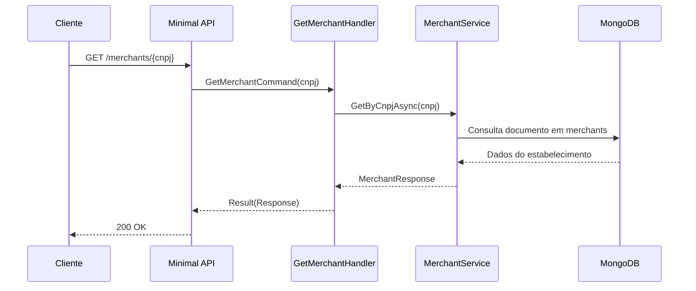

# GetMerchantHandler

## Descrição
Consulta o cadastro completo de um estabelecimento credenciado através do seu CNPJ, retornando dados cadastrais, escopo de credenciadoras, arranjos autorizados e contas de liquidação.

- **Rota:** `GET /module/card-receivable/merchants/{cnpj}`
- **Retorno:** HTTP 200 com os dados do estabelecimento.

## Payload
Esta requisição não recebe corpo.

**Parâmetros de URL:**
- `cnpj`: CNPJ de 14 dígitos do estabelecimento.

**Resposta (HTTP 200):**
```json
{
  "data": {
    "cnpj": "22185894000174",
    "corporateName": "Loja Exemplo LTDA",
    "tradeName": "Loja Exemplo",
    "email": "contato@exemplo.com",
    "mobilePhone": "11987654321",
    "status": 1,
    "settlementAccounts": [
      {
        "account": "12345",
        "accountDigit": "6",
        "agency": "0001",
        "bank": "001",
        "accountType": "CC"
      }
    ],
    "acquirers": [
      {
        "cnpj": "01027058000191",
        "paymentArrangementCodes": ["VCC", "MCC"]
      }
    ]
  }
}
```

## Diagrama

