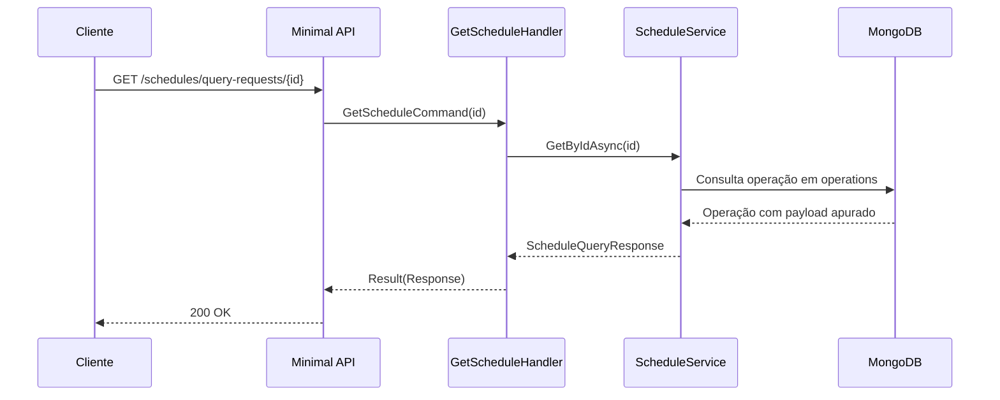

# GetScheduleHandler

## Descrição
Consulta o resultado de uma solicitação de agenda pelo seu identificador (`requestId`), retornando o status de apuração (`PROCESSING`, `PROCESSED` ou `ERROR`) e os recebíveis futuros agrupados por credenciadora, arranjo e data de vencimento.

- **Rota:** `GET /module/card-receivable/schedules/query-requests/{id}`
- **Retorno:** HTTP 200 com os dados da agenda.

## Payload
Esta requisição não recebe corpo.

**Parâmetros de URL:**
- `id`: identificador UUID da solicitação de agenda (`requestId`).

**Resposta (HTTP 200):**
```json
{
  "data": {
    "status": "PROCESSED",
    "detail": "Agenda processada com sucesso",
    "scheduleQueryData": {
      "requestId": "fc3ec865-f088-4e22-af68-5581c280d3dc",
      "originType": "ONLINE",
      "updatedAt": "2026-10-04T12:00:00Z",
      "merchantCnpj": "22185894000174",
      "acquirers": [
        {
          "cnpj": "01027058000191",
          "paymentArrangements": [
            {
              "code": "VCC",
              "receivableUnits": [
                {
                  "settlementDate": "2026-11-10",
                  "totalAmount": 10000.00,
                  "freeAmount": 7500.00
                }
              ]
            }
          ]
        }
      ]
    }
  }
}
```

## Diagrama

