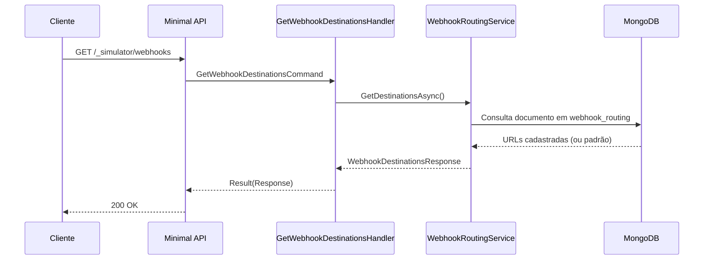

# GetWebhookDestinationsHandler

## Descrição
Consulta as URLs de destino efetivas e persistidas para entregas de webhooks de agenda e contratos de antecipação.

- **Rota:** `GET /_simulator/webhooks`
- **Retorno:** HTTP 200 com as URLs atuais.

## Payload
Esta requisição não recebe corpo.

**Resposta (HTTP 200):**
```json
{
  "data": {
    "scheduleUrl": "http://localhost:5090/webhooks/card-receivables/schedules/updated",
    "contractUrl": "http://localhost:5090/webhooks/card-receivable/schedules",
    "persisted": true
  }
}
```

## Diagrama

