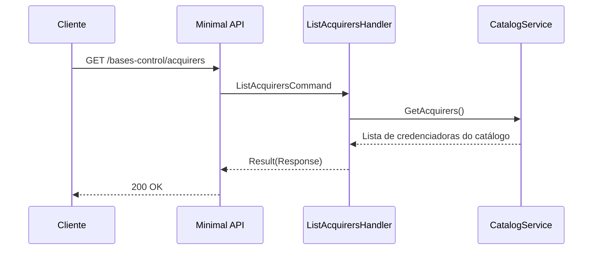

# ListAcquirersHandler

## Descrição
Retorna o catálogo de credenciadoras (adquirentes) de cartão suportadas pela plataforma, com seus respectivos CNPJs e razões sociais.

- **Rota:** `GET /module/card-receivable/bases-control/acquirers`
- **Retorno:** HTTP 200 com a lista de credenciadoras.

## Payload
Esta requisição não recebe corpo.

**Resposta (HTTP 200):**
```json
{
  "data": [
    {
      "cnpj": "01027058000191",
      "name": "CIELO S.A."
    },
    {
      "cnpj": "08561701000101",
      "name": "REDE S.A."
    }
  ]
}
```

## Diagrama

