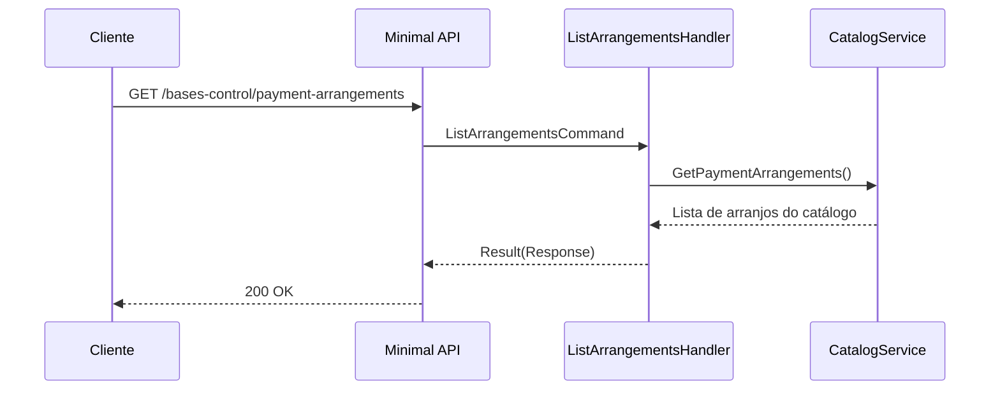

# ListArrangementsHandler

## Descrição
Retorna o catálogo de arranjos de pagamento suportados pelo simulador (bandeira e modalidade de crédito ou débito, ex: Visa Crédito `VCC`, Mastercard Crédito `MCC`).

- **Rota:** `GET /module/card-receivable/bases-control/payment-arrangements`
- **Retorno:** HTTP 200 com a lista de arranjos de pagamento.

## Payload
Esta requisição não recebe corpo.

**Resposta (HTTP 200):**
```json
{
  "data": [
    {
      "code": "VCC",
      "description": "VISA CREDITO"
    },
    {
      "code": "MCC",
      "description": "MASTERCARD CREDITO"
    }
  ]
}
```

## Diagrama

