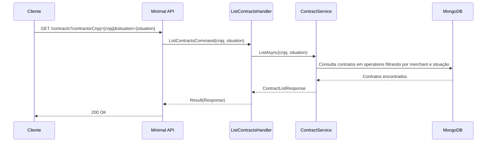

# ListContractsHandler

## Descrição
Lista os contratos de antecipação registrados para um determinado estabelecimento credenciado, com filtro opcional por situação (`ACTIVE` ou `INACTIVE`).

- **Rota:** `GET /module/card-receivable/contracts?contractorCnpj={cnpj}&situation={situation}`
- **Retorno:** HTTP 200 com a lista de contratos.

## Payload
Esta requisição não recebe corpo.

**Parâmetros de Query:**
- `contractorCnpj` (obrigatório): CNPJ do estabelecimento contratante.
- `situation` (opcional): situação do contrato (`ACTIVE` ou `INACTIVE`).

**Resposta (HTTP 200):**
```json
{
  "data": [
    {
      "externalReference": "CON/07237373/21892484000109/051026/120000",
      "financierContractId": "HTTP-1791216610601-TOTAL",
      "status": 1,
      "contractorCnpj": "22185894000174",
      "effectType": 1,
      "signatureDate": "2026-10-05",
      "dueDate": "2026-11-10",
      "guaranteedLimitAmount": 2500.00,
      "reachedAmount": 2500.00,
      "updatedAmount": 2500.00
    }
  ]
}
```

A listagem mantém a mesma `externalReference` da criação e dos retries. Novos contratos usam CON; registros antigos conservam suas referências persistidas. `financierContractId` preserva o identificador fornecido pelo cliente ou o fallback existente quando omitido.

## Diagrama

