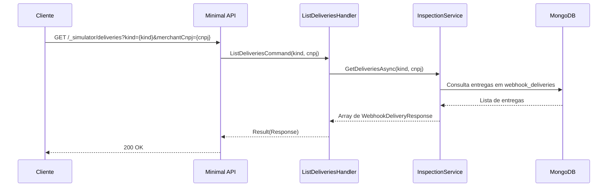

# ListDeliveriesHandler

## Descrição
Inspeciona a fila outbox de entregas de webhooks (`webhook_deliveries`), exibindo o histórico de envios, URLs de destino, contagem de tentativas, status HTTP da última resposta e confirmação de entrega (`delivered`).

- **Rota:** `GET /_simulator/deliveries?kind={kind}&merchantCnpj={cnpj}`
- **Retorno:** HTTP 200 com a lista de entregas.

## Payload
Esta requisição não recebe corpo.

**Parâmetros de Query (opcionais):**
- `kind`: tipo do evento (`schedule` ou `contract`).
- `merchantCnpj`: CNPJ do estabelecimento para filtrar entregas.

**Resposta (HTTP 200):**
```json
[
  {
    "eventKey": "fc3ec865-f088-4e22-af68-5581c280d3dc",
    "kind": "contract",
    "merchantCnpj": "22185894000174",
    "destinationUrl": "http://localhost:5090/webhooks/card-receivable/schedules",
    "attempts": 1,
    "delivered": true,
    "lastHttpStatus": 200,
    "createdAt": "2026-10-04T12:00:00Z"
  }
]
```

## Diagrama

