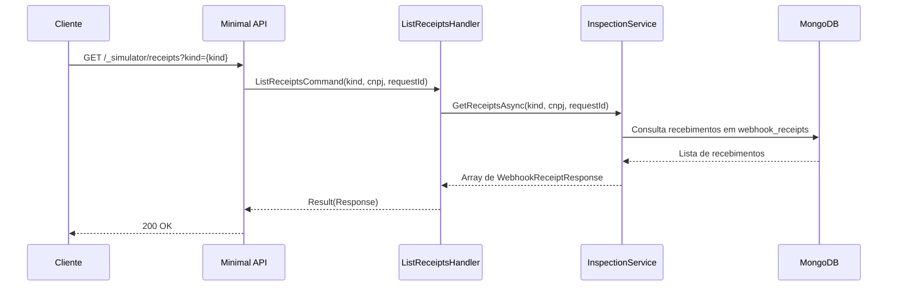

# ListReceiptsHandler

## Descrição
Consulta o histórico de notificações de webhook recebidas diretamente pelos endpoints internos de diagnóstico da API (`webhook_receipts`).

- **Rota:** `GET /_simulator/receipts?kind={kind}&merchantCnpj={cnpj}`
- **Retorno:** HTTP 200 com a lista de comprovantes de recebimento.

## Payload
Esta requisição não recebe corpo.

**Parâmetros de Query (opcionais):**
- `kind`: tipo do webhook recebido (`schedule` ou `contract`).
- `merchantCnpj`: CNPJ do estabelecimento.
- `requestId`: identificador da solicitação correlacionada.

**Resposta (HTTP 200):**
```json
[
  {
    "receiptId": "b18583c0-5e19-44f0-a9c4-9fe935da7d9b",
    "kind": "schedule",
    "merchantCnpj": "22185894000174",
    "idempotencyKey": "97185893-bec9-481b-a096-f2202a980cef",
    "receivedAt": "2026-10-04T12:00:00Z"
  }
]
```

## Diagrama

