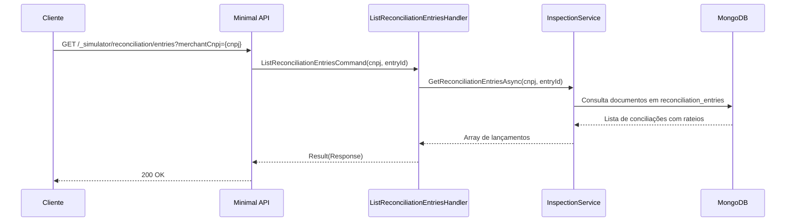

# ListReconciliationEntriesHandler

## Descrição
Consulta o histórico do ledger de conciliação bancária (`reconciliation_entries`), detalhando as alocações aplicadas a cada contrato/recebível e eventuais valores não alocados (excedentes).

- **Rota:** `GET /_simulator/reconciliation/entries?merchantCnpj={cnpj}`
- **Retorno:** HTTP 200 com os lançamentos de conciliação.

## Payload
Esta requisição não recebe corpo.

**Parâmetros de Query (opcionais):**
- `merchantCnpj`: CNPJ do estabelecimento titular.
- `entryId`: identificador do lançamento bancário específico.

**Resposta (HTTP 200):**
```json
[
  {
    "entryId": "d018583c-5e19-44f0-a9c4-9fe935da7d9b",
    "referenceDate": "2026-10-04",
    "merchant": "22185894000174",
    "acquirer": "01027058000191",
    "value": 2500.00,
    "unallocatedAmount": 0.00,
    "receivables": [
      {
        "externalReference": "REF-CONTRATO-001",
        "settlementDate": "2026-11-10",
        "amount": 2500.00
      }
    ]
  }
]
```

## Diagrama

