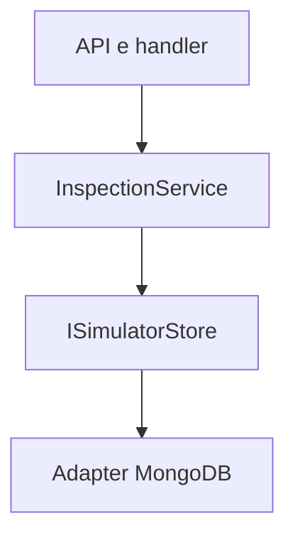
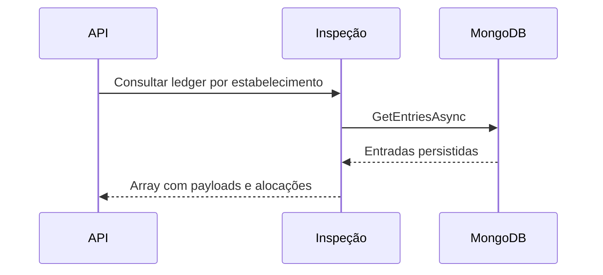

# ListReconciliationEntriesHandler

## Objetivo e entrada
Consulta o ledger com os payloads originais, alocações por contrato/UR e excedentes.

- Rota: `GET /_simulator/reconciliation/entries`.
- Filtro opcional: `merchantCnpj`.
- Resposta: HTTP 200, array direto sem envelope.
- A rota existe quando os controles do simulador estão habilitados.

## Exemplo de resposta
```json
[
  {
    "entryId": "d018583c-5e19-44f0-a9c4-9fe935da7d9b",
    "merchantCnpj": "22185894000174",
    "entry": {
      "entryId": "d018583c-5e19-44f0-a9c4-9fe935da7d9b",
      "referenceDate": "2026-10-05",
      "merchant": "22185894000174",
      "acquirer": "01027058000191",
      "bankAccount": "12345-6",
      "value": 2500.00
    },
    "receivables": [
      {
        "externalReference": "CON/07237373/21892484000109/051026/120000",
        "holderCnpj": "22185894000174",
        "acquirerCnpj": "01027058000191",
        "paymentArrangementCode": "VCC",
        "settlementDate": "2026-11-10",
        "amount": 2500.00
      }
    ],
    "unallocatedAmount": 0.00
  }
]
```

## Regras, efeitos e dependências
O lançamento pode conter várias alocações, e várias entradas podem corresponder à mesma UR. Alocações mais valor não alocado somam o valor original. A consulta não grava nem reprocessa pagamentos e não muda a dívida, o status ou a agenda. `entryId` não é filtro desta rota; o consumidor pode selecionar o lançamento no array retornado.

Lê reconciliation_entries por ISimulatorStore/MongoDB. Não chama APIs externas nem publica eventos. Erros inesperados seguem o tratamento centralizado da API. Mantém a observabilidade existente; essa rota de controle retorna os payloads sintéticos persistidos e não acrescenta logs bancários.

## Estrutura e sequência



## Código e testes
`ListReconciliationEntriesHandler`, `InspectionService.ListEntriesAsync`, `InspectionMappings`; `ReconciliationFlowTests` e testes existentes de inspeção.
