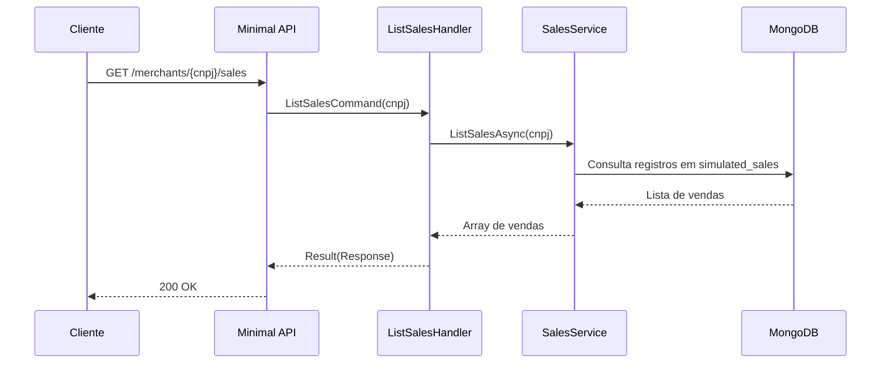

# ListSalesHandler

## Descrição
Retorna a listagem de parcelas de vendas com cartão sintéticas geradas e persistidas no banco de dados para um determinado estabelecimento comercial.

- **Rota:** `GET /_simulator/merchants/{cnpj}/sales`
- **Retorno:** HTTP 200 com a lista de vendas.

## Payload
Esta requisição não recebe corpo.

**Parâmetros de URL:**
- `cnpj`: CNPJ do estabelecimento titular das vendas.

**Resposta (HTTP 200):**
```json
[
  {
    "saleId": "s18583c0-5e19-44f0-a9c4-9fe935da7d9b",
    "acquirerCnpj": "01027058000191",
    "paymentArrangementCode": "VCC",
    "settlementDate": "2026-11-10",
    "amount": 5000.00,
    "installmentNumber": 1
  }
]
```

## Diagrama

