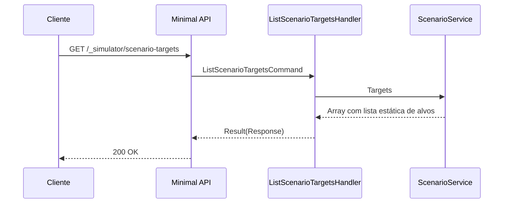

# ListScenarioTargetsHandler

## Descrição
Retorna a lista com todos os alvos e operações suportadas pelo simulador para injeção de cenários (falhas HTTP, status de ciclo e webhooks).

- **Rota:** `GET /_simulator/scenario-targets`
- **Retorno:** HTTP 200 com array de strings contendo os alvos.

## Payload
Esta requisição não recebe corpo.

**Resposta (HTTP 200):**
```json
[
  "merchant-create",
  "merchant-get",
  "merchant-patch",
  "merchant-delete",
  "acquirers-list",
  "arrangements-list",
  "sales-generate",
  "schedule-submit",
  "schedule-query",
  "contract-create",
  "contract-list",
  "contract-query",
  "reconciliation",
  "schedule-process",
  "contract-process",
  "schedule-webhook",
  "contract-webhook"
]
```

## Diagrama

