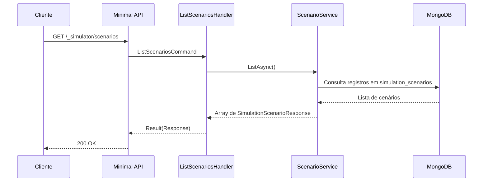

# ListScenariosHandler

## Descrição
Retorna todos os cenários de simulação ativos configurados na base de dados, exibindo alvos, CNPJs, contadores de chamadas e sequências restantes.

- **Rota:** `GET /_simulator/scenarios`
- **Retorno:** HTTP 200 com a lista de cenários configurados.

## Payload
Esta requisição não recebe corpo.

**Resposta (HTTP 200):**
```json
[
  {
    "target": "schedule-process",
    "merchantCnpj": "22185894000174",
    "failuresRemaining": 1,
    "failureStatusCode": 503,
    "holdProcessing": false,
    "calls": 1,
    "processingOutcomes": ["PROCESSED"],
    "contractStatuses": []
  }
]
```

## Diagrama

