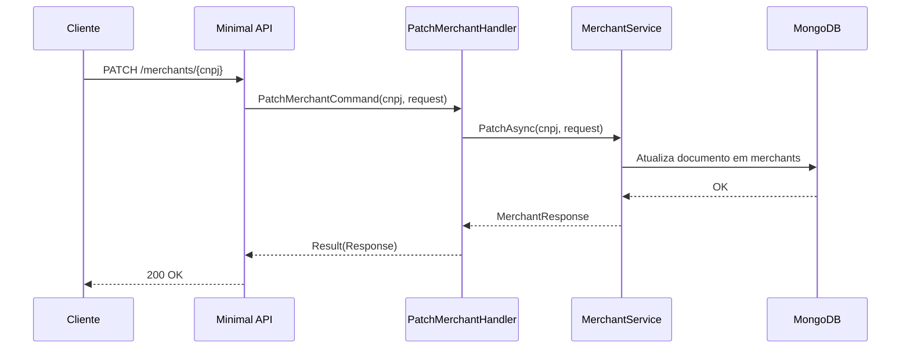

# PatchMerchantHandler

## Descrição
Atualiza parcialmente os dados cadastrais de um estabelecimento comercial credenciado, permitindo alterar e-mail, telefone, credenciadoras, arranjos e contas de liquidação.

- **Rota:** `PATCH /module/card-receivable/merchants/{cnpj}`
- **Retorno:** HTTP 200 com os dados atualizados.

## Payload
**Requisição (JSON):**
```json
{
  "email": "novo-email@exemplo.com",
  "mobilePhone": "11999998888",
  "acquirers": [
    {
      "cnpj": "01027058000191",
      "paymentArrangementCodes": ["VCC"]
    }
  ]
}
```

**Resposta (HTTP 200):**
```json
{
  "data": {
    "cnpj": "22185894000174",
    "corporateName": "Loja Exemplo LTDA",
    "tradeName": "Loja Exemplo",
    "email": "novo-email@exemplo.com",
    "mobilePhone": "11999998888",
    "status": 1
  }
}
```

## Diagrama

