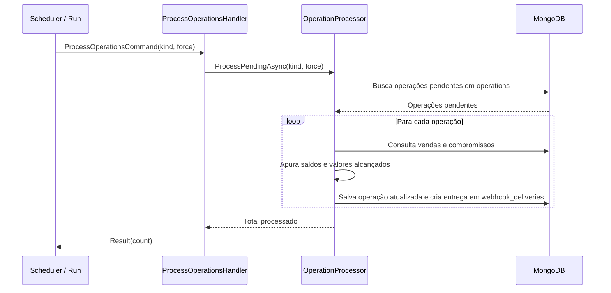

# ProcessOperationsHandler

## Descrição
Processa as operações financeiras pendentes (solicitações de agenda e pedidos de antecipação de contrato), apurando as vendas de cartão cadastradas, calculando saldos livres e enfileirando as notificações de webhook na fila outbox.

- **Invocação:** Executado periodicamente pelo scheduler em background (`ScheduledProcessingHandler`) ou explicitamente via `POST /_simulator/run`.
- **Retorno:** Quantidade de operações processadas no ciclo.

## Payload
Este handler é acionado internamente através do comando `ProcessOperationsCommand(Kind: "schedule" | "contract", Force: bool)`.

**Resultado Interno:**
- Para agenda: atualiza status para `PROCESSED` (ou `ERROR`) e enfileira webhook de atualização de agenda.
- Para contrato: atualiza status para `Active` (ou `Cancelled`), calcula valores alcançados por UR, debita agendas existentes e enfileira webhook de contrato.

## Diagrama

