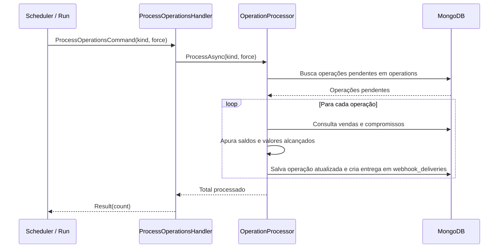

# ProcessOperationsHandler

## Descrição
Processa as operações financeiras pendentes (solicitações de agenda e pedidos de antecipação de contrato), apurando as vendas de cartão cadastradas, calculando saldos livres e enfileirando as notificações de webhook na fila outbox.

- **Invocação:** Executado periodicamente pelo scheduler em background (`ScheduledProcessingHandler`) ou explicitamente via `POST /_simulator/run`.
- **Retorno:** Quantidade de operações processadas no ciclo.

## Payload
Este handler é acionado internamente através do comando `ProcessOperationsCommand(Kind: "schedule" | "contract", Force: bool)`.

**Resultado Interno:**
- Para agenda: atualiza status para `PROCESSED` (ou `ERROR`) e enfileira webhook de atualização de agenda.
- Para contrato: atualiza status para `Active` (ou `Cancelled`), calcula valores alcançados por UR, debita agendas existentes e enfileira webhook de contrato.

## Reservas e atualização de agenda

Toda regeneração automática considera pedidos ainda `PROCESSING`, além dos valores alcançados por contratos Active/Settled e das antecipações externas. Isso mantém a política de saldo livre da agenda alinhada à admissão IMMEDIATE. Exemplo: UR de R$ 1.000, pedido pendente de R$ 600 e contrato ativo de R$ 200 resultam em R$ 200 livres, inclusive no webhook.

O registro continua apurando alcance parcial e preservando a ordem de processamento existente. PendingEdit/PendingRegistration continuam pendentes; não há evento adicional de agenda apenas por criar um pedido. Consultas GET retornam o snapshot armazenado, sem recalcular saldos a cada leitura.

Quando um pedido termina Cancelled ou ContractSimulation, agendas processadas que já incluíam sua reserva são regeneradas. Havendo mudança nos recebíveis, o novo snapshot e seu webhook liberam o saldo. Se os dados forem iguais, o snapshot e sua data de atualização são preservados e não há evento redundante. Estabelecimentos excluídos não recebem essa atualização. Active/Settled e refresh explícito conservam seu fluxo de atualização existente.

Regressões: `AgendaReservationConsistencyTests` e `ContractAgendaTests`, incluindo esquemas de webhook Schedule/ContractReceivables, coexistência de pendente/ativo, liberação de reserva e persistência após reinício.

## Diagrama

