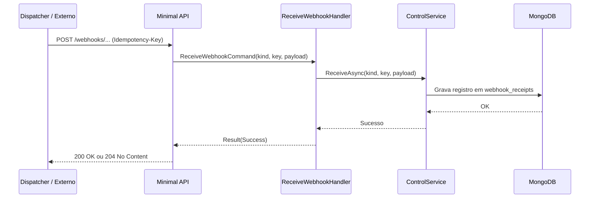

# ReceiveWebhookHandler

## Descrição
Receptores internos da API de diagnóstico utilizados para receber e registrar entregas de webhooks (agenda em português ou contrato em inglês) na coleção `webhook_receipts`.

- **Rotas:**
  - `POST /_simulator/webhooks/card-receivables/schedules/updated` (retorna HTTP 204)
  - `POST /_simulator/webhooks/card-receivable/schedules` (retorna HTTP 200)
- **Headers:** `Idempotency-Key` (UUID)

## Payload
**Exemplo de Requisição de Agenda (Português):**
```json
{
  "status": "PROCESSED",
  "detalhe": "Agenda processada com sucesso",
  "dadosConsultaAgenda": {
    "idRequisicao": "d018583c-5e19-44f0-a9c4-9fe935da7d9b",
    "tipoOrigem": "ONLINE",
    "dataHoraAtualizacao": "2026-10-04T12:00:00Z",
    "cnpjEstabelecimento": "22185894000174",
    "credenciadoras": []
  }
}
```

**Exemplo de Requisição de Contrato (Inglês):**
```json
{
  "status": "PROCESSED",
  "detail": "Contract processed",
  "scheduleQueryData": {
    "requestId": "fc3ec865-f088-4e22-af68-5581c280d3dc",
    "originType": "ONLINE",
    "updatedAt": "2026-10-04T12:00:00Z",
    "merchantCnpj": "22185894000174",
    "acquirers": []
  }
}
```

## Diagrama

