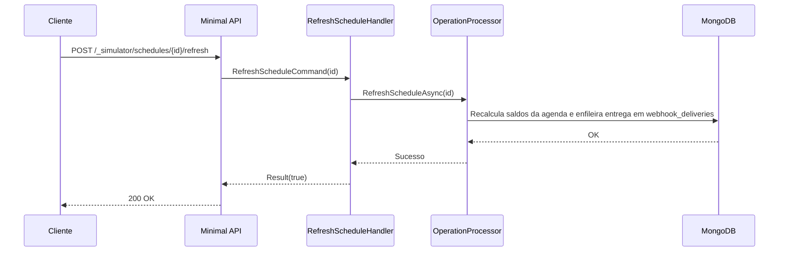

# RefreshScheduleHandler

## Descrição
Recalcula uma agenda existente que já havia sido apurada, incorporando novas vendas de cartão ou compromissos externos registrados posteriormente, e gera nova notificação de atualização de agenda.

- **Rota:** `POST /_simulator/schedules/{id}/refresh`
- **Retorno:** HTTP 200 com confirmação booleana.

## Payload
Esta requisição não recebe corpo.

**Parâmetros de URL:**
- `id`: identificador UUID da solicitação de agenda (`requestId`).

**Resposta (HTTP 200):**
```json
{
  "data": true
}
```

## Diagrama

