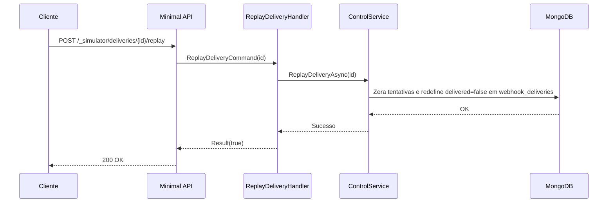

# ReplayDeliveryHandler

## Descrição
Reabre uma entrega de webhook existente na fila outbox (`webhook_deliveries`), zerando as tentativas e redefinindo `delivered = false`, para que o mesmo evento seja reenviado com seu payload e chave originais pelo dispatcher.

- **Rota:** `POST /_simulator/deliveries/{id}/replay`
- **Retorno:** HTTP 200 com confirmação booleana.

## Payload
Esta requisição não recebe corpo.

**Parâmetros de URL:**
- `id`: identificador da entrega de webhook (`deliveryId` ou `eventKey`).

**Resposta (HTTP 200):**
```json
{
  "data": true
}
```

## Diagrama

