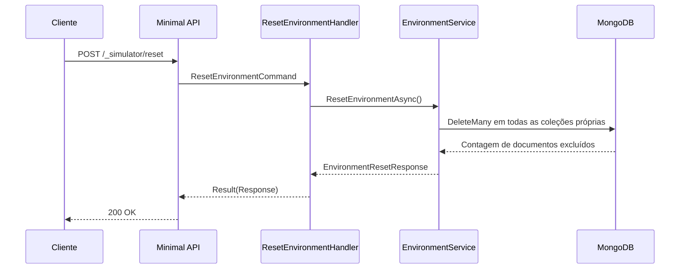

# ResetEnvironmentHandler

## Descrição
Executa a limpeza completa dos dados do simulador nas coleções do MongoDB (estabelecimentos, vendas, agendas, contratos, conciliações, cenários e webhooks), retornando a quantidade total de documentos removidos e restaurando o ambiente para o estado inicial.

- **Rota:** `POST /_simulator/reset`
- **Retorno:** HTTP 200 com a contagem de documentos removidos (`removedDocuments`).

## Payload
Esta requisição não recebe corpo.

**Resposta (HTTP 200):**
```json
{
  "data": {
    "removedDocuments": 42
  }
}
```

## Diagrama

