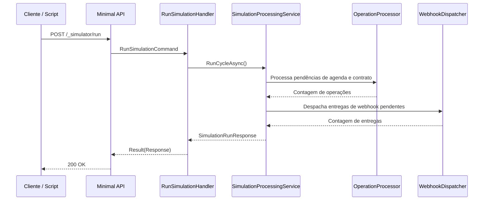

# RunSimulationHandler

## Descrição
Força a execução de um ciclo imediato e determinístico de processamento das operações pendentes (agendas e contratos) e de envio dos webhooks na fila outbox, permitindo testes rápidos sem aguardar os timers dos schedulers em background.

- **Rota:** `POST /_simulator/run`
- **Retorno:** HTTP 200 com a contagem de agendas, contratos e entregas processadas.

## Payload
Esta requisição não recebe corpo.

**Resposta (HTTP 200):**
```json
{
  "data": {
    "schedulesProcessed": 1,
    "contractsProcessed": 1,
    "deliveriesDispatched": 2
  }
}
```

## Diagrama

