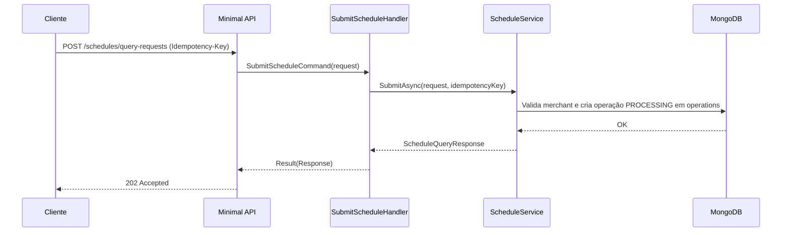

# SubmitScheduleHandler

## Descrição
Registra a solicitação assíncrona de consulta de agenda de recebíveis futuros de um estabelecimento credenciado. Cria a operação com status inicial `PROCESSING` e devolve um `requestId` para acompanhamento e correlação com a entrega de webhook.

- **Rota:** `POST /module/card-receivable/schedules/query-requests`
- **Headers:** `Idempotency-Key` (UUID)
- **Retorno:** HTTP 202 Accepted com o identificador da solicitação (`requestId`).

## Payload
**Requisição (JSON):**
```json
{
  "merchantCnpj": "22185894000174",
  "queryType": "STANDARD"
}
```

**Resposta (HTTP 202):**
```json
{
  "data": {
    "requestId": "fc3ec865-f088-4e22-af68-5581c280d3dc",
    "status": "PROCESSING",
    "detail": "Solicitacao de agenda aceita e em processamento"
  }
}
```

## Diagrama

